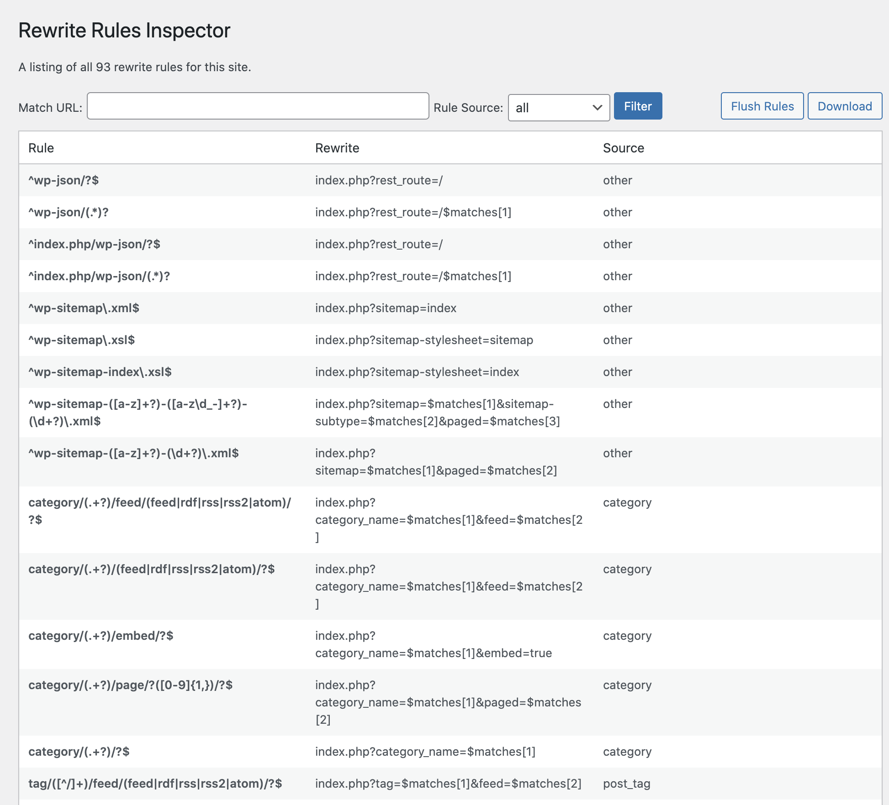
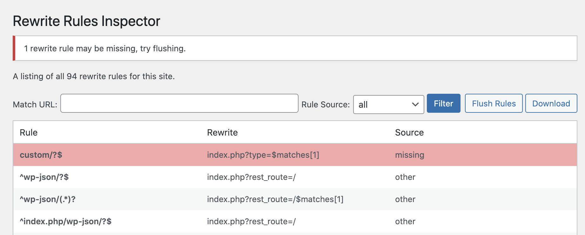

# Rewrite Rules Inspector

Stable tag: 1.4.0  
Requires at least: 5.9  
Tested up to: 6.5  
Requires PHP: 7.4  
License: GPLv2 or later  
Tags: rewrite rules, tools  
Contributors: danielbachhuber, automattic, tmoorewp, GaryJ

A simple admin tool for inspecting rewrite rules.

## Description

A simple WordPress admin tool for inspecting rewrite rules. View a listing of all your rewrite rules, see which rewrite rules match a given URL (and the priorites they match in), or filter by different sources of rewrite rules. Perform a soft flush of your rewrite rules to regenerate them.

Originally developed for clients hosted at [WordPress VIP](https://wpvip.com/), we thought it would be useful for development environments, etc. too. Feel free to [fork the plugin in GitHub](https://github.com/Automattic/Rewrite-Rules-Inspector/) — pull requests are always welcome. Hit us with feedback, questions, bug reports, and feature requests in the GitHub issues.

## Installation

### Install the plugin from within WordPress

1. Visit the Plugins page from your WordPress dashboard and click "Add New" at the top of the page.
1. Search for "rewrite-rules-inspector" using the search bar on the right side.
1. Click "Install Now" to install the plugin.
1. After it's installed, click "Activate" to activate the plugin on your site.

### Install the plugin manually

1. Download the plugin from WordPress.org or get the latest release from our [Github Releases page](https://github.com/automattic/Rewrite-Rules-Inspector/releases).
1. Unzip the downloaded archive.
1. Upload the entire `rewrite-rules-inspector` folder to your `/wp-content/plugins` directory.
1. Visit the Plugins page from your WordPress dashboard and look for the newly installed plugin.
1. Click "Activate" to activate the plugin on your site.

## Screenshots

1. See which rewrite rules match a given URL, and the priorities they match in.  
   

2. An error message appears if rewrite rules are missing in the database  
   
   
## Changelog

See the [change log](https://github.com/automattic/Rewrite-Rules-Inspector/blob/master/CHANGELOG.md).
