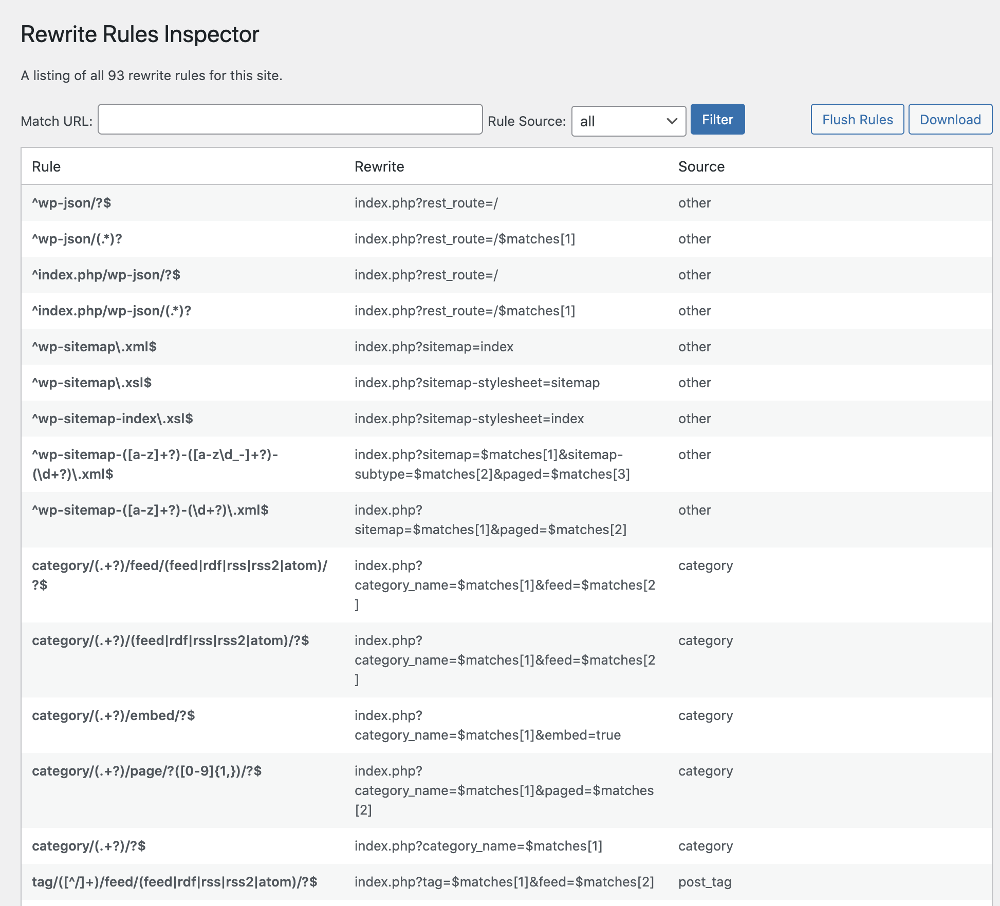
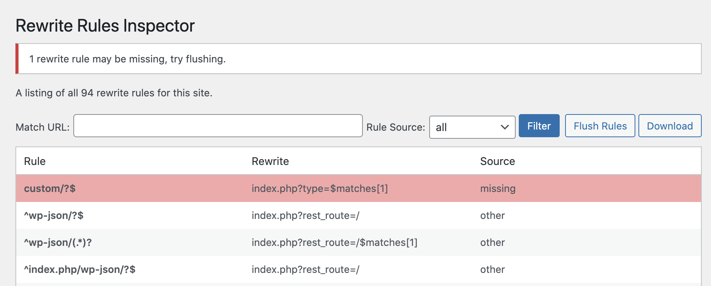
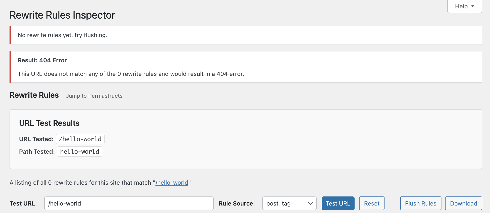
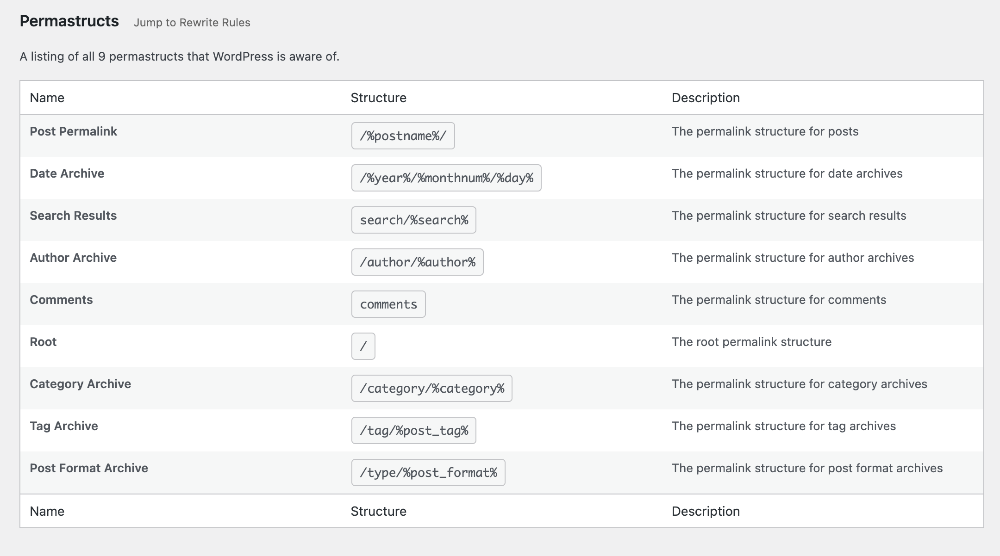

# Rewrite Rules Inspector

Stable tag: 1.5.0  
Requires at least: 5.9  
Tested up to: 6.8  
Requires PHP: 7.4  
License: GPLv2 or later  
Tags: rewrite rules, tools  
Contributors: danielbachhuber, automattic, tmoorewp, GaryJ

A simple admin tool for inspecting rewrite rules.

## Description

A simple WordPress admin tool for inspecting rewrite rules. View a listing of all your rewrite rules, see which rewrite rules match a given URL (and the priorities they match in), or filter by different sources of rewrite rules. Perform a soft flush of your rewrite rules to regenerate them.

[Developed on GitHub](https://github.com/Automattic/Rewrite-Rules-Inspector/) — pull requests are always welcome. Please leave feedback, questions, bug reports, and feature requests in the GitHub issues.

### Where to find it

Go to `Tools → Rewrite Rules` in the WordPress admin.

### URL Tester

Quickly test any URL (or path) against your site's rewrite rules:

- See whether the URL would be a **404** or which rule would match first (the one WordPress uses).
- View the list of **all matching rules**, in match priority order.
- Inspect the **query variables** extracted from the match and the resulting **final query** WordPress would run.

Works with full URLs or paths and automatically handles sites installed in a subdirectory.

### Permastructs

Browse a table of all **permastructs** that WordPress is aware of, including:

- **Name** — the permastruct key (e.g. for posts, taxonomies, authors).
- **Structure** — the permalink structure pattern used to generate rules.
- **Description** — a human-friendly summary of what the permastruct controls.

## Installation

### Install the plugin from within WordPress

1. Visit the Plugins page from your WordPress dashboard and click "Add New" at the top of the page.
1. Search for "rewrite-rules-inspector" using the search bar on the right side.
1. Click "Install Now" to install the plugin.
1. After it's installed, click "Activate" to activate the plugin on your site.

### Install the plugin manually

1. Download the plugin from WordPress.org or get the latest release from our [GitHub Releases page](https://github.com/automattic/Rewrite-Rules-Inspector/releases).
1. Unzip the downloaded archive.
1. Upload the entire `rewrite-rules-inspector` folder to your `/wp-content/plugins` directory.
1. Visit the Plugins page from your WordPress dashboard and look for the newly installed plugin.
1. Click "Activate" to activate the plugin on your site.

## Screenshots

1. See all of the rewrite rules and flush them or download them.  
   

2. Test a URL against the rules to see which one(s) would match, and the priority they would match in.  
   

3. Limit rules and URL testing results down to specificrule sources.  
   

4. See which permastructs WordPress knows about.  
   

## Changelog

See the [change log](https://github.com/automattic/Rewrite-Rules-Inspector/blob/master/CHANGELOG.md).
